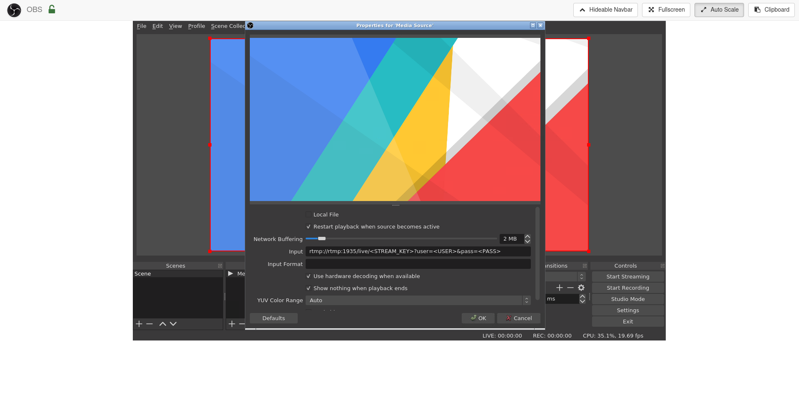
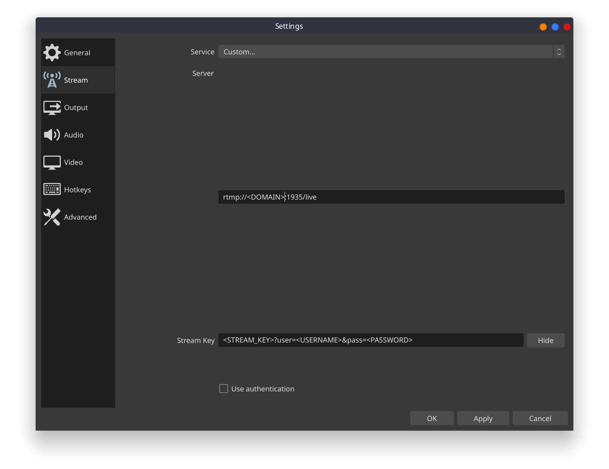

# MonSec Cloud Stream

Live streaming host server for multiple remote presenters. Designed to quickly spin up and down before and after streams to keep hosting costs low.

## Features
- RTMP server
- OBS Studio over web VNC
- OBS Remote
- Performance monitoring with Netdata
- Automatic HTTPS support
- Dynamic DNS with DuckDNS
  - Presenters can connect to the same URL for each stream, even if the server IP changes

## One time setup

### 1. Register for DuckDNS
Create an account at [DuckDNS](https://www.duckdns.org) and create a subdomain to use for the streaming server.

### 2. Set up DNS
Go to your DNS provider and create a CNAME record to your DuckDNS subdomain (`xxx.duckdns.org`). Be sure to use a short TTL. You will be able to use this to access the web interface and as the RTMP destination.

## Setting up the server

### 1. Clone this repo
```
git clone --recursive git@github.com:monsec/cloud-stream.git
```

### 1. Install Docker and Docker-Compose
A convenience script (`install-docker.sh`) is provided.

### 2. Create the configuration
Copy the example config: `cp .env.example .env`.

**NOTE:** Username and password can not contain single quotes or characters which need to be URL-enoded

| Variable | Description |
|----------|-------------|
| PRODUCTION | Whether this is a production server. Will enable automatic HTTPS |
| DOMAIN | The full domain name that points to this server/the DuckDNS subdomain. |
| DUCKDNS_SUBDOMAIN | DuckDNS subdomain created for this app. `xxx.duckdns.org` |
| DUCKDNS_TOKEN | [DuckDNS token](https://www.duckdns.org/domains). If using the default subdomain, log in with the MonSec Google account. |
| AUTH_USER | Used to authenticate the web interface and RTMP. |
| AUTH_PASS | Used to authenticate the web interface and RTMP. |

### 4. Start up the server
```
docker-compose up -d
```

### 5. Set up OBS

Open up OBS via the web interface.

#### Auto-config
Run the auto-configuration wizard with these settings
- Base (Canvas) Resolution: 1920x1080
- FPS: Prefer 60
- Service: Twitch
- Stream Key: [Get your Twitch stream key](https://www.twitch.tv/broadcast/dashboard/streamkey)
- Estimate bitrate with bandwidth test: Yes

In `Settings -> Stream` set the Twitch server to your AWS region.

#### Add presenter feed

Add a media source for each presenter with the following settings. Stream key can be anything as long as it is unique to each presenter. Right-click the source and select `Transform -> Fit to screen`.



#### Adding overlays
Feel free to add overlays as usual. Any media assets put in the `config/user` folder will be accessible inside the container at `/config/user`.

**Note:** Files in the user directory may have their permissions changed. If you aren't able to modify or delete the file, you may need to become superuser first.

### 6. Start streaming!
At this point you can take a snapshot or backup of your config to speed up setup in future sessions.

## Setting up presenters

Set up OBS Studio with the following Stream settings. Stream key is the value defined in the media source above.



### Previewing

VLC is able to preview the raw feed by going to `Media -> Open Network Stream` and using the following network URL.
```
rtmp://<DOMAIN>:1935/live/<STREAM_KEY>?user=<USERNAME>&pass=<PASSWORD>
```

## Tearing down

### 1. Stop the server
```
docker-compose down
```

### 2. Save important files
While almost everything is designed to be disposed and recreated, there are a couple of things that need to be kept between sessions. Make sure to back up `.env` and the `config` directory, and restore them before the next run.

### 3. Terminate the host server